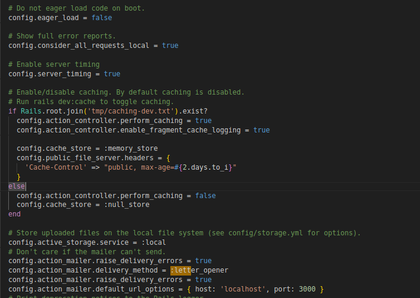

# Título del Proyecto

Prueba Tecnica en Ruby on Rails diseñada para consumir 4 APIs. 

## Descripción

Test Ecommerce es una aplicación Ruby on Rails diseñada para gestionar un mercado en línea que consume datos de cuatro API.

## EDR
### Imagen del diagrama entidad relacion


## Imagenes
### Imagenes del ejemplo de correos


### Prerrequisitos

Lista de software y herramientas, incluyendo versiones, que necesitas para instalar y ejecutar este proyecto:

- Ruby 1.9.3
- Rails 3.0.0
- PostgreSQL
- ImageMagick
- Redis

## Configuración

1. Clona el repositorio:

```bash
# git clone https://github.com/tu-usuario/myapp.git
```

### Instalación

Una guía paso a paso sobre cómo configurar el entorno de desarrollo e instalar todas las dependencias.

```bash
# bundle install Instalar dependencias
```

```bash
# rails db:create - Crear la base de datos
# rails db:migrate - Generar las migraciones
```

```bash
# Para este paso es necesario encender el servicio de sidekiq, ya que, se estaran enviando correos al momento de correr el seed para generar compras
# bundle exec sidekiq
```

```bash
# Para evitar que se sature el navegador con correo cada que se crea un nuevo registro de purchses es necesario cambiar a ':test' la siguiente linea de codigo en enviroments/development
```



```bash
# rails db:seed
```
### Uso de APIs
```bash
# Una vez se hayan cargado los datos correctamente, ya es posible consumir las APIs, para ello se deja dentro del proyecto la coleccion de peticiones para ser importadas en postman [ecommerce_collection.postman_collection]
```

